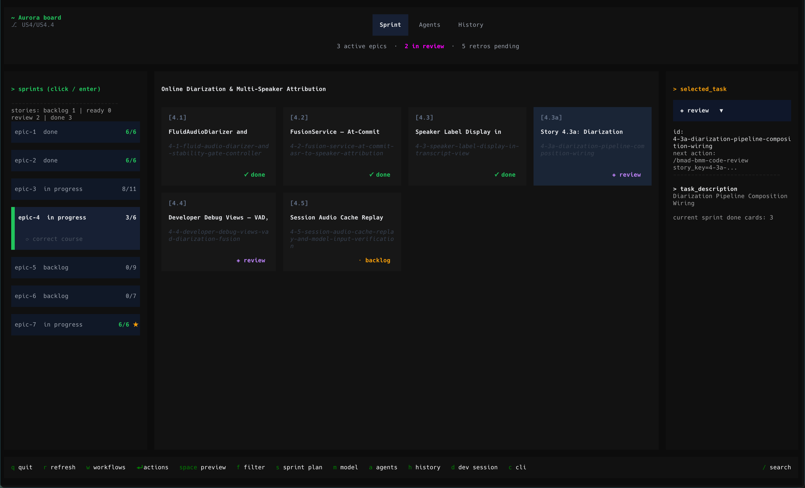

<h1 align="center">
  <br>
  BMAD Dashboard TUI
  <br>
</h1>

<p align="center">
  <strong>Terminal mission control for BMAD projects.</strong><br>
  Story board · agent launcher · bootstrap wizard · session history
</p>

<p align="center">
  
  
  
  
  
</p>



---

## What This Is

BMAD Dashboard TUI turns BMAD from a big set of prompts, phases, files, agents, and branching choices into one clear operating surface.

Instead of bouncing between markdown files, trying to remember which workflow to run next, and losing the thread of the sprint, you open the dashboard and see the project as it actually stands right now:

- which epic is active
- which stories need to be created
- which ones are ready for dev
- which work is in review
- what you ran last
- which agent or workflow should happen next

That is the value of this tool. It reduces friction, lowers the mental overhead of using BMAD well, and helps you stay oriented when a project starts getting large or messy.

BMAD is powerful, but it also gives you a lot of options. This TUI makes those options feel navigable instead of overwhelming.

---

## Why It Feels Better

Without a dashboard, BMAD can feel like this:

- many commands
- many agents
- many phases
- many artifact files
- many places to lose context

With this TUI, the workflow becomes much more grounded:

- your sprint status is visible at a glance
- story state is derived automatically from BMAD artifacts
- the next action is attached to the story in front of you
- global workflows stay accessible without cluttering the whole process
- session history gives you continuity instead of guesswork

The result is not just convenience. It changes the emotional experience of running a BMAD project. The repo feels calmer, more legible, and easier to drive.

---

## What It Does

BMAD Dashboard TUI reads the project’s BMAD artifacts, builds a live view of the sprint, and lets you launch the right workflow from the terminal.

- Render the current sprint directly from BMAD output files
- Distinguish `needs-story`, `ready-for-dev`, `in-progress`, `review`, `done`, and blocked work
- Launch story-specific workflows such as create story, dev story, code review, and course correction
- Launch global workflows for planning, architecture, research, QA, documentation, and quick flows
- Bootstrap a new BMAD repo when `sprint-status.yaml` does not exist yet
- Track workflow history with timestamps, model used, session ID, API time, and code-change stats
- Resume or rerun prior sessions from the dashboard

It is effectively a standalone extraction of the BMAD TUI used in other repos such as Aurora and Zoe Validator.

---

## How It Thinks About The Project

The dashboard is driven by BMAD’s own files, not by a separate database or custom project model.

It reads:

- `_bmad-output/planning-artifacts/prd.md`
- `_bmad-output/planning-artifacts/architecture.md`
- `_bmad-output/planning-artifacts/epics.md`
- `_bmad-output/implementation-artifacts/sprint-status.yaml`
- `_bmad-output/implementation-artifacts/*.md` story files

From that, it gives you a smart operational view of the repo:

- backlog stories without a file become `needs-story`
- backlog stories with a file become `ready-for-dev`
- stories in `review` naturally route toward CR flow
- finished work remains visible without dominating the board

That smart tracking is a big part of the point. You do not need to reconstruct project state in your head every time you come back to the repo.

---

## Workflow Coverage

The registry groups work under BMAD-style phases:

- `Analysis`
- `Planning`
- `UX`
- `Implementation`
- `QA`
- `Documentation`
- `Creative & Meta`

Representative workflows include:

- `create-prd`
- `create-architecture`
- `create-epics-and-stories`
- `sprint-planning`
- `create-story`
- `validate-story`
- `dev-story`
- `code-review`
- `correct-course`
- `technical-research`
- `qa-automate`
- `document-project`
- `quick-dev`
- `quick-spec`

Three model values are currently built into the app:

| Model | Intended use |
|-------|--------------|
| `claude-sonnet-4.6` | Default for planning and implementation |
| `claude-opus-4.6` | Deeper reasoning for more complex sessions |
| `gpt-5.3-codex` | Locked for CR Loop / code review workflow |

---

## Install

The installer is the intended entry point.

```bash
./install.sh
```

What the installer does:

- installs the TUI into `~/.local/share/bmad-tui`
- creates a dedicated virtual environment there
- installs Python dependencies
- writes a global `tui` launcher into `~/.local/bin/tui`
- adds `~/.local/bin` to your shell PATH if needed

After that, the normal way to launch the app is:

```bash
tui
```

Run `tui` from anywhere inside a git repository that contains BMAD folders such as `_bmad` or `_bmad-output`. If you run it outside a git repo, or inside a repo that is not a BMAD project, it exits with a clear error instead of guessing.

---

## Requirements

### Runtime dependencies

| Requirement | Purpose |
|-------------|---------|
| Python 3.11+ | Runs the TUI and helper modules |
| `textual` | Terminal UI framework |
| `pyyaml` | Parses `sprint-status.yaml` |
| `pyfiglet` | Small presentation/CLI helper dependency |
| `expect` | Required for interactive CLI session orchestration |
| `copilot` or `claude` CLI | Actual BMAD agent backend |

### External CLIs

- GitHub Copilot CLI: `npm install -g @github/copilot-cli`
- Or Anthropic Claude CLI if you want to exercise the alternate backend
- `expect`: `brew install expect`

Copilot appears to be the primary and more fully exercised target in the current implementation.

---

## Getting Started

### 1. Install it once

```bash
./install.sh
```

### 2. Move into a BMAD project repo

The launcher looks upward for a git root and checks that the repo contains BMAD folders:

- `_bmad`
- `_bmad-output`

### 3. Launch it

```bash
tui
```

The bootstrap wizard is designed to run automatically when no sprint status exists:

```text
Create PRD
  → Create Architecture
  → Create Epics & Stories
  → Sprint Planning
```

### 4. Study the implementation

If you want to understand how it works internally, start here:

- [`bmad_tui/dashboard.py`](/Users/comicbit/Projects/BMAD_METHOD_TUI/bmad_tui/dashboard.py)
- [`bmad_tui/workflows.py`](/Users/comicbit/Projects/BMAD_METHOD_TUI/bmad_tui/workflows.py)
- [`bmad_tui/agent_runner.py`](/Users/comicbit/Projects/BMAD_METHOD_TUI/bmad_tui/agent_runner.py)
- [`bmad_tui/state.py`](/Users/comicbit/Projects/BMAD_METHOD_TUI/bmad_tui/state.py)
- [`bmad_tui/wizard.py`](/Users/comicbit/Projects/BMAD_METHOD_TUI/bmad_tui/wizard.py)

---

## Key Interactions

The dashboard tests and docs describe these main bindings:

| Key | Action |
|-----|--------|
| `↑ ↓` | Navigate stories |
| `Enter` | Open story action modal |
| `Space` | Preview story markdown |
| `r` | Refresh state from BMAD artifacts |
| `f` | Cycle status filter |
| `1`-`6` | Jump to common filters |
| `s` | Run sprint planning |
| `a` | Open agent launcher |
| `m` | Change model |
| `h` | Open history |
| `q` | Quit |

---

## Project Layout

```text
BMAD_METHOD_TUI/
├── README.md
├── bmad-tui.sh
├── install.sh
├── assets/
│   └── bmad_tui_screenshot.png
└── bmad_tui/
    ├── __main__.py
    ├── dashboard.py
    ├── agent_runner.py
    ├── workflows.py
    ├── state.py
    ├── models.py
    ├── wizard.py
    ├── history.py
    ├── config.py
    ├── session.expect
    ├── requirements.txt
    └── tests/
```

---

## Why This Project Matters

Most BMAD workflows are powerful but fragmented across prompts, markdown artifacts, and external agent CLIs. This TUI gives that system an operational surface:

- one dashboard instead of scattered files
- one place to choose the next workflow
- one record of what was run, with which model, and whether it can be resumed
- one onboarding path for new BMAD projects

That is the right product direction. The next step for this repo is not redefining the concept; it is finishing the extraction so the standalone package, scripts, and tests all agree on a single import path.
